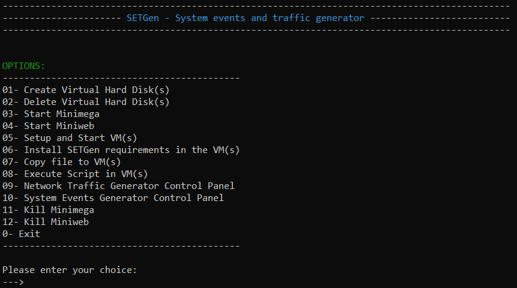

# Minimega Wrapper Manual

### Last Updated: 4th August 2020
---

Minimega Wrapper is an all-in-one script that provides the ability to control Minimega VMs, generate traffic within and between VM(s) using the Network Wrapper etc.

As of now, Ubuntu is the only supported operating system.

---

## Prerequisites

1) Minimega:

    Please ensure that Minimega is installed.

2) Miniweb:

    Please ensure that Miniwb is installed and the binaries are located in the /opt/bin directory.

3) Tmux:
   
    Tmux is a terminal multiplexer for Unix-like operating systems. It allows multiple terminal sessions to be accessed simultaneously in a single window. It is useful for running more than one command-line program at the same time.

    To install Tmux, run the following command:

        sudo apt install tmux

4) SSHPass:

    SSHPass is a tiny utility, which allows you to provide the ssh password without using the prompt. This is very helpful for scripting.

    To install SSHPass, run the following command:

        apt-get install sshpass

5) D-ITG:

    D-ITG (Distributed Internet Traffic Generator) is a platform capable of producing IPv4 and IPv6 traffic by accurately replicating the workload of current Internet applications.

    To install D-ITG and its dependencies, run the following command:

        sudo apt-get install -y d-itg

6) Root User Permissions

    In-order to use the Wrapper, root permissions are required.

    To login as the root user, run the following command:

	    sudo su

## Installation

0) **Make sure that the prerequisites are installed**
   

1) Unzip the installation file to the desired director
   

2) Change directory to the MinimegaWrapper directory
   

3) To change the permissions of the script, run

        chmod +x MinimegaWrapper.sh

4) To change the permissions of all dependencies, run

        chmod +x scripts/*

5) Kill all instances of Minimega processes

6) With root user permissions, run

        ./MinimegaWrapper.sh

## Notes

1) To avoid network traffic conflicts in Cross-VM Traffic Generation, we are allowing only a unique pair of Host/Dest VM to generate traffic. So, if host A is generating traffic to host B, both B and A can’t receive/send traffic from/to a different VM as long as A is generating traffic to B.

2) It is strongly advised NOT to modify any files in tmp/ directory.

3) In the main menu, you can type “clear” as an option to clear the screen.

## Tutorial

1) Main menu options

    